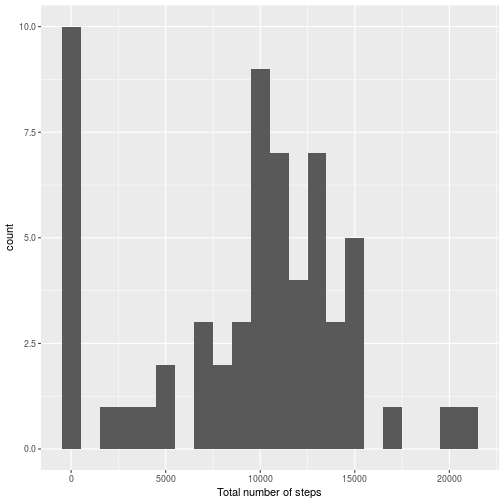
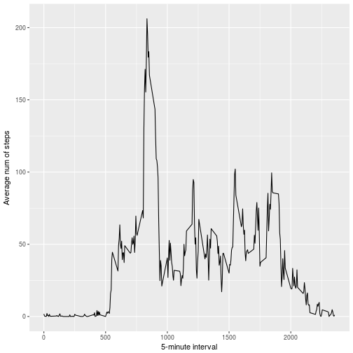
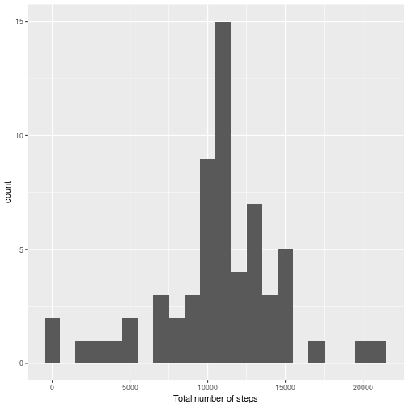
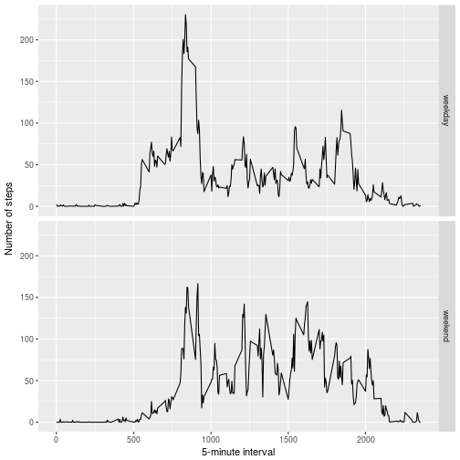

# Reproducible Research: Peer Assessment 1


## Loading and preprocessing the data

First, load the CSV data.


```r
unzip(zipfile="activity.zip")
df = read.csv("activity.csv")
```

Then transform it into a `data.table` object, for convenience.


## What is mean total number of steps taken per day?

First, calculate the total number of steps taken per day.


```r
daySum = DT[, list(stepSum=sum(steps, na.rm=T)), by=date]
```

Then, visualize a histogram of the result.



Calculate and report `mean` and `median` of the total number of steps.


```r
mean(daySum$stepSum)
```

```
## [1] 9354.23
```

```r
median(daySum$stepSum)
```

```
## [1] 10395
```

## What is the average daily activity pattern?

Make a time series plot of the 5-minute interval (x-axis) and the average number of steps taken, averaged across all days (y-axis)


```r
intervalMean = DT[, mean(steps, na.rm=T), by=interval]

ggplot(intervalMean, aes(interval, V1)) +
    geom_line() +
    xlab("5-minute interval") +
    ylab("Average num of steps")
```



Which 5-minute interval, on average across all the days in the dataset, contains the maximum number of steps?


```r
# Using data.table power
intervalMean[, .SD[which.max(V1)]]$interval
```

```
## [1] 835
```

## Imputing missing values

Calculate and report the total number of missing values in the dataset


```r
sum(apply(is.na(DT), 1, sum))
```

```
## [1] 2304
```
Devise a strategy for filling in all of the missing values in the dataset. The strategy does not need to be sophisticated. For example, you could use the mean/median for that day, or the mean for that 5-minute interval, etc.


```r
# We will fill with mean value already stored in
# the data.table intervalMean
fillNA = function(intervalID) intervalMean[interval==intervalID]$V1
```

Create a new dataset that is equal to the original dataset but with the missing data filled in.


```r
rows = which(is.na(DT$steps) == 1)
DTcopy = data.table(DT)
for (rowID in rows) {
    DTcopy[rowID]$steps = as.integer(fillNA(DT[rowID]$interval))
}
```

Make a histogram of the total number of steps taken each day and Calculate and report the mean and median total number of steps taken per day. Do these values differ from the estimates from the first part of the assignment? What is the impact of imputing missing data on the estimates of the total daily number of steps?


```r
daySum2 = DTcopy[, list(stepSum=sum(steps, na.rm=T)), by=date]
qplot(
    daySum2$stepSum,
    geom="histogram",
    xlab="Total number of steps",
    binwidth=1000
)
```



```r
mean(daySum2$stepSum)
```

```
## [1] 10749.77
```

```r
median(daySum2$stepSum)
```

```
## [1] 10641
```

The new `mean` and `median` are higher due to the (quite simple) filling strategy.

## Are there differences in activity patterns between weekdays and weekends?

Create a new factor variable in the dataset with two levels – “weekday” and “weekend” indicating whether a given date is a weekday or weekend day.


```r
weekLabels = c("Monday", "Tuesday", "Wednesday", "Thursday", "Friday")
weekSplit = factor(
        weekdays(as.Date(DTcopy$date)) %in% weekLabels,
        levels=c(TRUE, FALSE),
        labels=c("weekday", "weekend")
)
```

Make a panel plot containing a time series plot (i.e. 𝚝𝚢𝚙𝚎 = "𝚕") of the 5-minute interval (x-axis) and the average number of steps taken, averaged across all weekday days or weekend days (y-axis).


```r
DTcopy$dayType = weekSplit
aggregated = aggregate(steps ~ interval + dayType, data=DTcopy, mean)
ggplot(aggregated, aes(interval, steps)) +
    geom_line() +
    facet_grid(dayType ~ .) +
    xlab("5-minute interval") +
    ylab("Number of steps")
```


